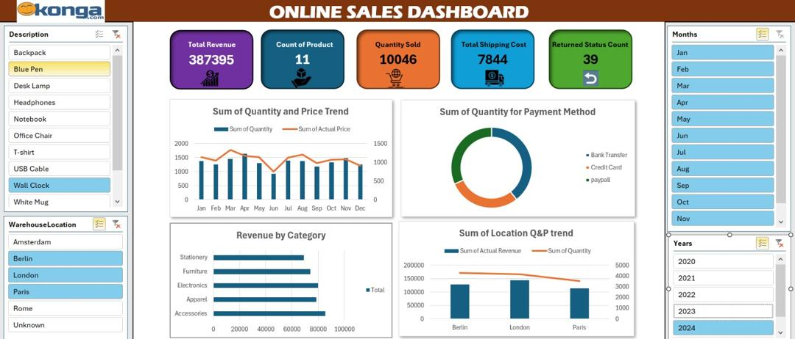

# 📊 Online Sales Dashboard

## 📝 Project Overview

This project presents an interactive **Online Sales Dashboard** built in **Microsoft Excel**, offering real-time insights into sales data. The dashboard uses PivotTables, charts, and slicers to provide a clear, user-friendly view of sales performance across various dimensions like product type, location, time, and payment method.

## ✅ Key Features

- **Total Revenue, Product Count, Shipping Cost, and Return Metrics** all at a glance.
- Visual breakdown of:
  - Monthly **Quantity and Price trends**.
  - Sales by **Payment Method**.
  - **Revenue by Product Category**.
  - **Location-based Performance** (Revenue & Quantity).
- Interactive **Slicers** for:
  - Product Description
  - Warehouse Location
  - Month
  - Year

## 🛠 Tools & Techniques Used

- **Microsoft Excel**:
  - PivotTables & PivotCharts
  - Slicers and Timeline
  - Data cleaning and formatting
- **Data Visualization**: Column charts, line graphs, pie charts, and KPIs
- **Data Model**: Structured using Excel Tables for dynamic data updates

## 📈 Use Cases

- Quick business insights for e-commerce or retail platforms
- Tracking and comparing product performance across different periods
- Identifying top-performing locations and categories

## 🧠 How to Use

1. Open `Online-Sales-Dashboard.xlsx` in Excel.
2. Use slicers (on the left and right of the dashboard) to filter data by category, location, month, or year.
3. Observe how charts and KPIs dynamically update based on your selections.

## 📌 Future Improvements

- Connect to external data sources using Power Query or Power BI
- Automate data refresh using VBA or Power Automate
- Add trendline forecasting and advanced analytics

## 🙌 Credits

Created by [Adebola Manuwa](https://www.linkedin.com/in/adebola-manuwa-025512265?utm_source=share&utm_campaign=share_via&utm_content=profile&utm_medium=ios_app)
Excel | Data Analytics | Visualization

